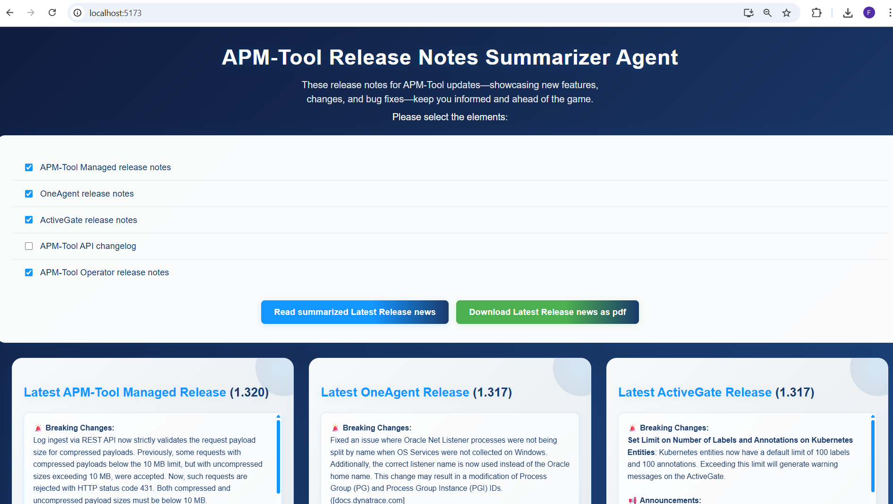

# Dynatrace Release Summarizer Agent

## Overview

The **Dynatrace Release Summarizer Agent** is an AI-powered web application designed to streamline the process of tracking and understanding Dynatrace release notes across all major components. This intelligent tool automatically fetches, processes, and summarizes the latest release information from official Dynatrace documentation, providing teams with comprehensive, structured insights about new features, breaking changes, technology updates, and bug fixes. Additionally, it generates downloadable PDF reports for easy documentation and sharing across teams.

## Screenshots

### Application Interface

*Interactive component selection interface with real-time validation*

### Release Summary Display

*AI-generated structured summaries with categorized release information*

### Key Features

- **Multi-Component Support**: Covers all major Dynatrace components:
  - **OneAgent**: Monitoring agent for application and infrastructure
  - **ActiveGate**: Gateway component for data routing and processing
  - **Dynatrace API**: REST API endpoints and integration capabilities
  - **Dynatrace Operator**: Kubernetes operator for container orchestration
  - **Dynatrace Managed**: Self-hosted Dynatrace platform

- **AI-Powered Summarization**: Leverages OpenAI's GPT-4o model to:
  - Extract latest version information from official documentation
  - Generate structured summaries categorized by impact and type
  - Identify breaking changes, new features, technology support updates, and resolved issues

- **Professional PDF Export**: Generate downloadable PDF reports containing:
  - Timestamped release summaries with proper formatting
  - Component-specific version information and categorized changes
  - Professional layout optimized for documentation and sharing

- **Intuitive User Interface**: Modern React frontend featuring:
  - Component selection with real-time validation
  - Responsive grid layout for release summaries
  - Conditional PDF download functionality

### Technical Architecture

- **Backend**: FastAPI-based REST API with asynchronous processing
- **Frontend**: React with Vite for fast development and modern JavaScript features
- **AI Integration**: OpenAI GPT-4o with web search capabilities for real-time documentation analysis
- **PDF Generation**: ReportLab library for professional document creation
- **Data Processing**: Parallel component processing for optimal performance

### Use Cases

- **DevOps Teams**: Stay informed about infrastructure and monitoring updates
- **Development Teams**: Track API changes and new integration capabilities
- **Platform Engineers**: Monitor Kubernetes operator and platform updates
- **Management**: Generate executive summaries of technology updates
- **Documentation**: Create timestamped records of Dynatrace evolution

## Project Structure
- `backend`: FastAPI backend
- `frontend`: React frontend (Vite)

## Getting Started

### Backend (FastAPI)
1. Create and activate your Conda environment.
2. Install dependencies:
   ```sh
   pip install -r backend/requirements.txt
   ```
3. Run the backend:
   ```sh
   uvicorn backend.main:app --reload
   ```

### Frontend (React)
1. Navigate to the frontend directory:
   ```sh
   cd frontend
   ```
2. Install dependencies:
   ```sh
   npm install
   ```
3. Start the development server:
   ```sh
   npm run dev
   ```
